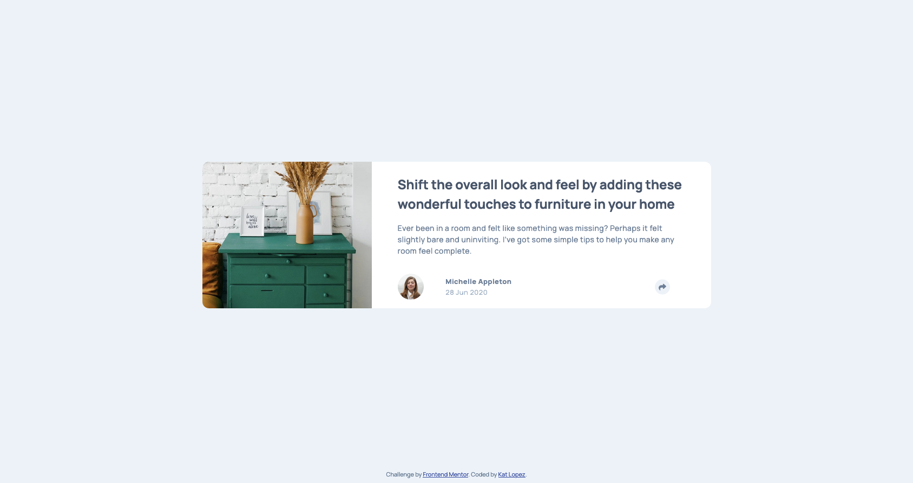
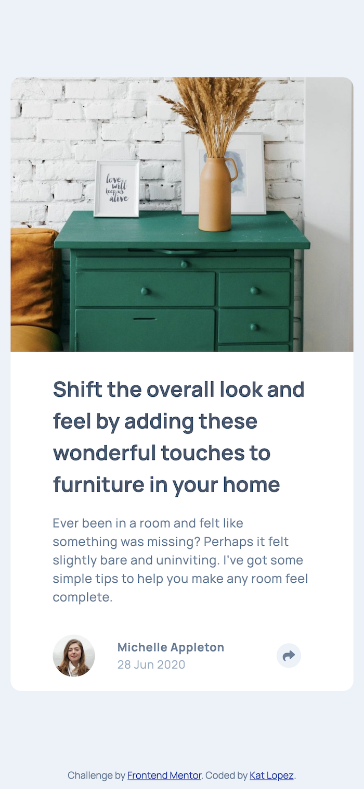

# Frontend Mentor - Article preview component solution

This is a solution to the [Article preview component challenge on Frontend Mentor](https://www.frontendmentor.io/challenges/article-preview-component-dYBN_pYFT). Frontend Mentor challenges help you improve your coding skills by building realistic projects. 

## Table of contents

- [Overview](#overview)
  - [The challenge](#the-challenge)
  - [Screenshots](#screenshots)
  - [Links](#links)
- [My process](#my-process)
  - [Built with](#built-with)
- [Author](#author)

## Overview

### The challenge

Users should be able to:

- View the optimal layout for the component depending on their device's screen size
- See the social media share links when they click the share icon

### Screenshots

**Desktop:**

**Mobile:**

### Links

- Solution URL: [GitHub](https://github.com/kkatlopez/frontend-mentor/tree/main/article-preview-component)
- Live Site URL: [Vercel](https://frontend-mentor-kkatlopez.vercel.app/article-preview-component/index.html)

## My process

### Built with

- Semantic HTML5 markup
- CSS custom properties
- Bootstrap
- Flexbox
- Mobile-first workflow
- jQuery

## Author

- Website - [Kat Lopez](https://linkedin.com/in/kkatlopez)
- Frontend Mentor - [@kkatlopez](https://www.frontendmentor.io/profile/kkatlopez)
