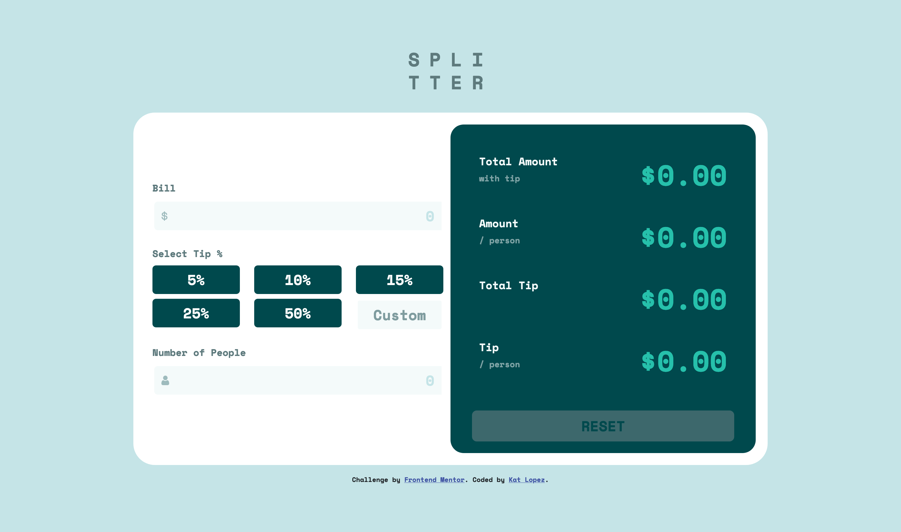

# Frontend Mentor - Tip calculator app solution

This is a solution to the [Tip calculator app challenge on Frontend Mentor](https://www.frontendmentor.io/challenges/tip-calculator-app-ugJNGbJUX). Frontend Mentor challenges help you improve your coding skills by building realistic projects.

## Table of contents

- [Overview](#overview)
  - [The challenge](#the-challenge)
  - [Screenshot](#screenshot)
  - [Links](#links)
- [My process](#my-process)
  - [Built with](#built-with)
  - [What I learned](#what-i-learned)
  - [Continued development](#continued-development)
- [Author](#author)

## Overview

### The challenge

Users should be able to:

- View the optimal layout for the app depending on their device's screen size
- See hover states for all interactive elements on the page
- Calculate the correct tip and total cost of the bill per person

### Screenshot



### Links

- Solution URL: [GitHub repository](https://github.com/kkatlopez/frontend-mentor/tree/main/tip-calculator)
- Live Site URL: [Vercel](https://frontend-mentor-kkatlopez.vercel.app/tip-calculator/index.html)

## My process

### Built with

- Semantic HTML5 markup
- CSS custom properties
- Bootstrap
- Flexbox
- Mobile-first workflow
- jQuery

### What I learned

This project required a decent amount of jQuery to perform the calculations and also getting the form inputs. The code snippets below are the ones that required the most learning.

Below is a code snipped of how I calculated the tip and total amount per person from the HTML form. There are checks for if the amount of the bill or number of people are less than 1. If true, an `error` class is added to let the user know that the input is invalid.

```javascript
$("#bill-form").on('.bill-data input', function() {
    var amount = $("#bill-amt").val();
    var people = $("#bill-people").val();
    if (amount < 1 && amount.length != 0) {
        $(".input-group#bill").addClass("error").removeClass("input-focus");
        $("#bill-error").text("Enter an amount greater than 0").css("color", "#cf491d");
    } else if (Number.isNaN(amount)) {
        $(".input-group#bill").addClass("error").removeClass("input-focus");
    } else {
        $(".input-group#bill").removeClass("error");
        $("#bill-error").empty();
    }
    if (people < 1 && people.length != 0) {
        $(".input-group#num-people").addClass("error").removeClass("input-focus");
        $("#people-error").text("Enter quantity greater than 0").css("color", "#cf491d");
    } else {
        $(".input-group#num-people").removeClass("error");
        $("#people-error").empty();
    }
    var totalPer;
    var tipPer;
    if (amount && people && tip) {
        $("#reset-form").attr("disabled", false);
        var bill = billMath(amount, people, tip);
        totalPer = bill[0];
        tipPer = bill[1];
    }
    if (isFinite(totalPer) || isFinite(tipPer)) {
        $("#total-per").text("$" + totalPer);
        $("#tip-per").text("$" + tipPer);
    }
});
```

I also wrote a function to get calculate the tip and total amount per person called `billMath` that is used in the code above. It takes the amount, people, and tip inputted by the user and returns an array of the total per person and tip per person.

```javascript
function billMath($amount, $people, $tip) {
    var totalPerPerson = (((1 + $tip) * $amount) / $people).toFixed(2);
    var tipPerPerson = (($amount * $tip) / $people).toFixed(2);
    return [totalPerPerson, tipPerPerson];
}
```

Adding the focus states was a little bit difficult. jQuery has two functions called `focusin` and `focusout` that helped with that. Below is how those are used for the bill amount and number of people inputs. The class `input-focus` has the style for the focus state.

```javascript
var inputGroup = $(".input-group");
inputGroup.focusin(function() {
    $(this).addClass("input-focus");
});
inputGroup.focusout(function() {
    $(this).removeClass("input-focus");
});
```

I also used media queries to accomodate different screensizes. Below is an example for screensizes that are below 991.98px (tablet size).

```css
@media(max-width: 991.98px) {
    input[type="number"],
    input[type="number"]:focus,
    .btn {
        font-size: 16px;
    }
    .card {
        border-radius: 16px;
    }
    .card-body {
        margin: 0;
    }
    #bill-output {
        border-radius: 12px;
        padding: 2rem !important;
        margin-top: 1rem;
    }
    .total {
        height: 90px;
        font-size: 36px;
    }
    .bill-header {
        font-size: 16px;
    }
    .bill-header span {
        font-size: 12px;
    }
}
```

### Continued development

Here are a few things I want to add to the project:

- [ ] Display total tip amount
- [ ] Display amount per person before tip
- [ ] Do not let users input non-float values

In general, I would also like to clean up the JS code and see how I could make it more efficient.

## Author

- Website - [Kat Lopez](https://linkedin.com/in/kkatlopez)
- Frontend Mentor - [@kkatlopez](https://www.frontendmentor.io/profile/kkatlopez)
